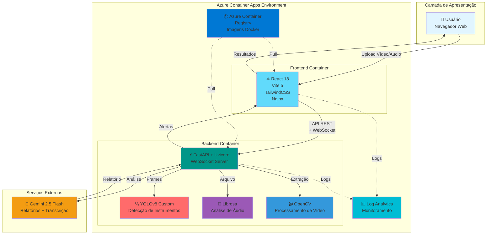

#  MedVision AI

**Plataforma de Análise Multimodal Cirúrgica com Inteligência Artificial**

Sistema fullstack para análise em tempo real de vídeos e áudios cirúrgicos ginecológicos, utilizando **YOLOv8** para detecção de instrumentos e anomalias visuais, **librosa** para análise de indicadores psicológicos de áudio, e **Google Gemini 2.5 Flash** para geração de relatórios clínicos detalhados.

>  **MVP Acadêmico** - Projeto desenvolvido como estudo de viabilidade técnica de IA multimodal em contexto médico. Demonstra integração de visão computacional, processamento de áudio e modelos de linguagem avançados em um sistema de suporte à decisão clínica.

---

##  Índice

- [Visão Geral](#-visão-geral)
- [Arquitetura](#-arquitetura)
- [Funcionalidades](#-funcionalidades)
- [Tecnologias](#-tecnologias)
- [Pré-requisitos](#-pré-requisitos)
- [Instalação Local](#-instalação-local)
- [Deploy no Azure Container Apps](#-deploy-no-azure-container-apps)
- [Documentação Adicional](#-documentação-adicional)
- [Limitações](#-limitações-e-disclaimers)
- [Licença](#-licença)

---

##  Visão Geral

O **MedVision AI** é uma solução completa para análise assistida por IA de procedimentos cirúrgicos ginecológicos, oferecendo:

###  Análise de Vídeo Cirúrgico
- **Detecção de Instrumentos**: Identificação automática de 23 classes de instrumentos cirúrgicos ginecológicos usando YOLOv8 customizado
- **Detecção de Anomalias**: Sangramento, perfurações, queimaduras, obstruções, má visualização
- **Bounding Boxes Interativas**: Visualização em tempo real com cores por tipo e espessura por severidade
- **Classificação de Risco**: Automática (crítico/warning/info) baseada em confiança e tipo de anomalia
- **Timeline de Eventos**: Navegação frame-by-frame com detecções sincronizadas

###  Análise de Áudio de Consultas
- **Extração de Features Acústicas**: MFCC, pitch, energia RMS, zero-crossing rate, spectral centroid
- **Indicadores Psicológicos**: Detecção de estresse, fadiga, ansiedade, depressão, trauma
- **Segmentação Temporal**: Janelas de 5 segundos com overlap de 2.5s
- **Transcrição Automática**: Conversão de fala para texto (formatos MP3, WAV, OGG, M4A)
- **Relatórios Especializados**: Contextualizados por tipo de consulta (ginecológica, pré-natal, pós-parto)

###  Relatórios com IA Generativa
- **Google Gemini 2.5 Flash**: Modelo multimodal de última geração
- **Análise Contextual**: Interpretação inteligente das detecções do YOLOv8 e features de áudio
- **Recomendações Clínicas**: Sugestões baseadas em padrões detectados
- **Formato Estruturado**: Markdown com emojis para melhor legibilidade

---

##  Arquitetura

### Fluxo de Processamento
