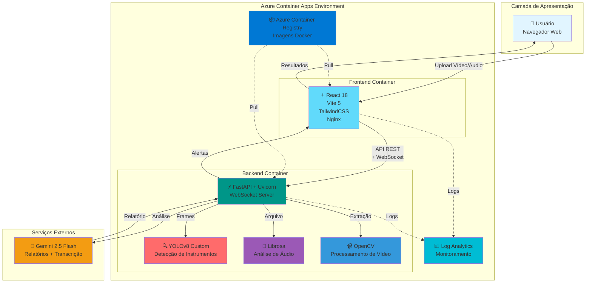

#  MedVision AI

[](https://www.python.org/downloads/)
[](https://fastapi.tiangolo.com/)
[](https://reactjs.org/)
[](https://azure.microsoft.com/products/container-apps)
[](./docker-compose.yml)
[](./LICENSE)

<div align="center">

### 🩺💜 Inteligência Artificial a Serviço da Saúde da Mulher

</div>

## 🌟 O que é o MedVision AI?

Imagine um **assistente inteligente** que consegue "assistir" vídeos de cirurgias ginecológicas e "ouvir" consultas médicas, ajudando profissionais de saúde a cuidar melhor das pacientes. É exatamente isso que o **MedVision AI** faz!

### 👁️ Como funciona?

**🎥 Análise de Vídeos Cirúrgicos**  
Treinamos uma **Inteligência Artificial especializada em visão computacional** para reconhecer instrumentos cirúrgicos e identificar situações que precisam de atenção durante procedimentos ginecológicos. É como ter um par de olhos extra que nunca perde um detalhe!

**🎤 Análise de Áudio de Consultas**  
O sistema também consegue ouvir e entender consultas médicas, identificando indicadores emocionais na voz da paciente (como estresse ou ansiedade) e transcrevendo tudo automaticamente para os registros médicos.

**📋 Relatórios Automáticos Inteligentes**  
Após analisar os vídeos e áudios, o sistema gera relatórios completos e organizados, poupando tempo dos profissionais e permitindo que se concentrem no que realmente importa: **cuidar das pacientes**!

### 🎯 Por que isso é importante?

- ✅ **Auxilia médicos** a identificar situações críticas mais rapidamente
- ✅ **Reduz sobrecarga** ao automatizar tarefas repetitivas de documentação
- ✅ **Melhora o atendimento** com registro completo e análise detalhada
- ✅ **Democratiza conhecimento** especializado através da tecnologia
- ✅ **Foca na saúde da mulher**, uma área que merece toda atenção e inovação

> 💡 **Projeto Acadêmico**: Desenvolvido como estudo de viabilidade técnica de IA aplicada à medicina. Este é um **protótipo educacional** que demonstra o potencial da tecnologia para revolucionar o cuidado em saúde.

---

### 📺 [Vídeo Demonstrativo](https://youtu.be/y4L6lIbFaIg)

---

<details>
<summary><b>📚 Para profissionais técnicos: Detalhes da implementação</b></summary>

**Plataforma de Análise Multimodal Cirúrgica com Inteligência Artificial**

Sistema fullstack para análise em tempo real de vídeos e áudios cirúrgicos ginecológicos, utilizando **YOLOv8** customizado para detecção de instrumentos e anomalias visuais, **librosa** para análise de indicadores psicológicos de áudio, e **Google Gemini 2.5 Flash** para geração de relatórios clínicos detalhados.

**Stack Técnico:**
- **Backend**: Python 3.11, FastAPI, Uvicorn, YOLOv8, OpenCV, Librosa
- **Frontend**: React 18, Vite 5, TailwindCSS
- **Features**: WebSocket real-time, processamento de vídeo frame-by-frame, análise acústica temporal
- **IA Generativa**: Google Gemini 2.5 Flash (multimodal)
- **Cloud**: Azure Container Apps, Azure Container Registry
- **Features**: WebSocket real-time, processamento de vídeo frame-by-frame, análise acústica temporal

</details>


---

##  Índice

- [Visão Geral](#-visão-geral)
- [Arquitetura](#-arquitetura)
- [Funcionalidades](#-funcionalidades)
- [Tecnologias](#-tecnologias)
- [Pré-requisitos](#-pré-requisitos)
- [Instalação Local](#-instalação-local)
- [Deploy no Azure Container Apps](#-deploy-no-azure-container-apps)
- [Documentação Adicional](#-documentação-adicional)
- [Limitações](#-limitações-e-disclaimers)
- [Licença](#-licença)

---

##  Visão Geral

O **MedVision AI** é uma solução completa para análise assistida por IA de procedimentos cirúrgicos ginecológicos, oferecendo:

###  Análise de Vídeo Cirúrgico
- **Detecção de Instrumentos**: Identificação automática de 23 classes de instrumentos cirúrgicos ginecológicos usando YOLOv8 customizado
- **Detecção de Anomalias**: Sangramento, perfurações, queimaduras, obstruções, má visualização
- **Bounding Boxes Interativas**: Visualização em tempo real com cores por tipo e espessura por severidade
- **Classificação de Risco**: Automática (crítico/warning/info) baseada em confiança e tipo de anomalia
- **Timeline de Eventos**: Navegação frame-by-frame com detecções sincronizadas

###  Análise de Áudio de Consultas
- **Extração de Features Acústicas**: MFCC, pitch, energia RMS, zero-crossing rate, spectral centroid
- **Indicadores Psicológicos**: Detecção de estresse, fadiga, ansiedade, depressão, trauma
- **Segmentação Temporal**: Janelas de 5 segundos com overlap de 2.5s
- **Transcrição Automática**: Conversão de fala para texto (formatos MP3, WAV, OGG, M4A)
- **Relatórios Especializados**: Contextualizados por tipo de consulta (ginecológica, pré-natal, pós-parto)

###  Relatórios com IA Generativa
- **Google Gemini 2.5 Flash**: Modelo multimodal de última geração
- **Análise Contextual**: Interpretação inteligente das detecções do YOLOv8 e features de áudio
- **Recomendações Clínicas**: Sugestões baseadas em padrões detectados
- **Formato Estruturado**: Markdown com emojis para melhor legibilidade

---

##  Arquitetura



### Fluxo de Processamento

####  Vídeo:
1. **Upload**  Usuário envia vídeo via interface React
2. **Validação**  Backend valida formato, tamanho e codec (MP4, AVI, MOV, MKV)
3. **Extração**  OpenCV extrai frames com sampling inteligente
4. **Detecção**  YOLOv8 analisa cada frame para instrumentos e anomalias
5. **Classificação**  Sistema atribui severidade (critical/warning/info)
6. **Alertas**  WebSocket envia notificações em tempo real ao frontend
7. **Relatório**  Gemini 2.5 Flash gera análise clínica contextualizada
8. **Visualização**  React exibe bounding boxes sincronizadas com player de vídeo

####  Áudio:
1. **Upload/Gravação**  Upload de arquivo ou gravação direta via microfone
2. **Validação**  Backend valida formato e tamanho
3. **Extração**  Librosa extrai features acústicas (MFCC, pitch, energia)
4. **Segmentação**  Divisão em janelas de 5s com overlap
5. **Classificação**  Detecção de indicadores psicológicos por segmento
6. **Transcrição**  Gemini 2.5 Flash converte fala em texto (exceto WebM)
7. **Relatório**  Análise psicológica detalhada por tipo de consulta
8. **Download**  Transcrição disponível em formato .txt

---

##  Funcionalidades

###  Análise de Vídeo

| Funcionalidade | Descrição |
|----------------|-----------|
| **23 Classes de Instrumentos** | Tesoura, pinça, gancho, afastador, aspirador, porta-agulha, bisturi, grampeador, trocar, clipador, morcelador, endoscópio, ótica, balão, manipulador uterino, cânula, agulha Veress, dreno, espéculo, tenáculo, swab, sonda Foley, cateter |
| **Detecção de Anomalias** | Sangramento, perfuração, queimadura, obstrução, má visualização |
| **Bounding Boxes Coloridas** | Verde (info), Amarelo (warning), Vermelho (crítico) |
| **Timeline Interativa** | Navegação frame-by-frame com marcadores de detecções |
| **Alertas em Tempo Real** | WebSocket para eventos críticos (sangramento >70% confiança) |
| **Metadados Completos** | FPS, resolução, duração, codec, frames analisados |

###  Análise de Áudio

| Funcionalidade | Descrição |
|----------------|-----------|
| **Gravação Direta** | Capture áudio do microfone via navegador (formato WebM) |
| **Upload de Arquivos** | Suporte para MP3, WAV, OGG, M4A (até 100 MB) |
| **Indicadores Detectados** | Depressão, ansiedade, estresse, fadiga, trauma, hesitação |
| **Segmentação Temporal** | Janelas de 5s com overlap de 2.5s para análise detalhada |
| **Tipos de Consulta** | Ginecológica, Pré-natal, Pós-parto, Geral |
| **Transcrição Automática** | Via Gemini 2.5 Flash (MP3/WAV/OGG/M4A) |
| **Níveis de Risco** | Low, Medium, High, Critical |

###  Relatórios com IA

| Seção | Conteúdo |
|-------|----------|
| ** Vídeo: Resumo Executivo** | Tipo de cirurgia inferido, duração, instrumentos detectados |
| ** Instrumentação Detectada** | Lista completa com frequência e confiança média |
| ** Anomalias e Riscos** | Detalhamento por tipo com timestamps e recomendações |
| ** Estruturas Anatômicas** | Órgãos identificados (útero, ovários, trompas, ligamentos) |
| ** Indicações Cirúrgicas** | Procedimentos inferidos (miomectomia, ooforectomia, etc.) |
| ** Análise Temporal** | Distribuição de detecções por minuto |
| ** Áudio: Perfil Vocal** | Prosódia, padrões temporais, marcadores acústicos |
| ** Indicadores Psicológicos** | Análise detalhada SE DETECTADO / SE NÃO DETECTADO |
| ** Linha do Tempo** | Momentos críticos com timestamps |
| ** Recomendações** | Organizadas por urgência e prazo (imediato, curto, médio) |

---

##  Tecnologias

### Backend (Python 3.11)

| Tecnologia | Versão | Função |
|------------|--------|--------|
| **FastAPI** | 0.115+ | Framework web assíncrono |
| **Uvicorn** | 0.32+ | Servidor ASGI de alta performance |
| **YOLOv8** | Ultralytics | Detecção de objetos em tempo real |
| **Librosa** | 0.10+ | Análise de áudio e extração de features |
| **OpenCV** | 4.10+ | Processamento de vídeo e imagens |
| **Google Gemini 2.5 Flash** | google-generativeai | IA generativa multimodal |
| **NumPy** | 1.26+ | Computação científica |
| **Pillow** | 10.4+ | Manipulação de imagens |
| **Pydantic** | 2.9+ | Validação de dados |

### Frontend (React 18)

| Tecnologia | Versão | Função |
|------------|--------|--------|
| **React** | 18.3+ | Biblioteca UI declarativa |
| **Vite** | 5.3+ | Build tool otimizado |
| **TailwindCSS** | 3.4+ | Framework CSS utility-first |
| **React Router** | 6.24+ | Roteamento SPA |
| **Axios** | 1.7+ | Cliente HTTP |
| **Lucide React** | 0.263+ | Ícones modernos |
| **React Hot Toast** | 2.4+ | Notificações |

### Infraestrutura

| Serviço | Função |
|---------|--------|
| **Azure Container Apps** | Hosting serverless de containers |
| **Azure Container Registry** | Armazenamento de imagens Docker |
| **Azure Log Analytics** | Monitoramento e logs centralizados |
| **Docker** | Containerização e isolamento |
| **Nginx Alpine** | Servidor web estático (frontend) |

---

##  Pré-requisitos

### Para Desenvolvimento Local

- **Python:** 3.11 ou superior
- **Node.js:** 18.0 ou superior
- **Docker:** 20.10 ou superior (opcional)
- **Git:** Para clonar o repositório
- **FFmpeg:** Necessário para librosa processar áudio

### Para Deploy no Azure

- **Conta Azure:** Com assinatura ativa (pode usar Azure for Students)
- **Azure CLI:** Versão 2.50+ instalada e configurada
- **Docker:** Para build de imagens
- **Google Gemini API Key:** Obtenha gratuitamente em [Google AI Studio](https://ai.google.dev/)

---

##  Instalação Local

### 1. Clone o Repositório

```bash
git clone https://github.com/seu-usuario/MedVisionAI.git
cd MedVisionAI
```

### 2. Configure o Backend

```bash
cd backend

# Crie ambiente virtual
python -m venv venv

# Ative o ambiente (Windows)
venv\Scripts\activate
# Ou no Linux/Mac
source venv/bin/activate

# Instale dependências
pip install -r requirements.txt

# Configure variáveis de ambiente
cp .env.production.example .env
# Edite .env e adicione sua API key do Gemini
```

### 3. Configure o Frontend

```bash
cd ../frontend

# Instale dependências
npm install

# Configure variável de ambiente
echo "VITE_API_URL=http://localhost:8000" > .env.local
```

### 4. Execute com Docker Compose (Recomendado)

```bash
# Na raiz do projeto
docker-compose up --build

# Acesse:
# Frontend: http://localhost:5173
# Backend: http://localhost:8000
# API Docs: http://localhost:8000/docs
```

 **Mais detalhes:** Consulte [docs/TESTE_LOCAL.md](./docs/TESTE_LOCAL.md) para troubleshooting completo.

---

##  Deploy no Azure Container Apps

### Visão Geral

Azure Container Apps é uma plataforma serverless para containers com auto-scaling e pay-per-use.

**Vantagens:**
-  **Sem gerenciamento de servidor** - Azure cuida da infraestrutura
-  **Auto-scaling** - Escala de 0 a N réplicas automaticamente
-  **Pay-as-you-go** - Pague apenas pelo que usar
-  **HTTPS automático** - Certificado SSL gratuito
-  **Logs centralizados** - Log Analytics integrado

### Deploy Rápido

**Pré-requisitos:**
- Azure CLI instalado (`winget install Microsoft.AzureCLI`)
- Login feito (`az login`)
- Gemini API Key obtida em [Google AI Studio](https://ai.google.dev/)

**Passos Básicos:**

```bash
# 1. Definir variáveis
$RESOURCE_GROUP="medvision-rg"
$LOCATION="brazilsouth"
$ACR_NAME="medvisionacr"  # Deve ser único
$GEMINI_API_KEY="sua-chave-aqui"

# 2. Criar Resource Group
az group create --name $RESOURCE_GROUP --location $LOCATION

# 3. Criar Azure Container Registry
az acr create --resource-group $RESOURCE_GROUP --name $ACR_NAME --sku Basic --admin-enabled true

# 4. Login no ACR
az acr login --name $ACR_NAME

# 5. Build e push backend
cd backend
docker build -t $ACR_NAME.azurecr.io/medvision-backend:latest .
docker push $ACR_NAME.azurecr.io/medvision-backend:latest

# 6. Build e push frontend
cd ../frontend
docker build -t $ACR_NAME.azurecr.io/medvision-frontend:latest .
docker push $ACR_NAME.azurecr.io/medvision-frontend:latest

# 7. Criar Container Apps Environment
az containerapp env create --name medvision-env --resource-group $RESOURCE_GROUP --location $LOCATION

# 8. Obter credenciais do ACR
$ACR_USERNAME=$(az acr credential show --name $ACR_NAME --query username -o tsv)
$ACR_PASSWORD=$(az acr credential show --name $ACR_NAME --query "passwords[0].value" -o tsv)

# 9. Deploy backend
az containerapp create \
  --name medvision-backend \
  --resource-group $RESOURCE_GROUP \
  --environment medvision-env \
  --image $ACR_NAME.azurecr.io/medvision-backend:latest \
  --registry-server $ACR_NAME.azurecr.io \
  --registry-username $ACR_USERNAME \
  --registry-password $ACR_PASSWORD \
  --target-port 8000 \
  --ingress external \
  --cpu 1.0 --memory 2.0Gi \
  --min-replicas 1 --max-replicas 3 \
  --env-vars GOOGLE_API_KEY=$GEMINI_API_KEY ENVIRONMENT=production STORAGE_TYPE=local

# 10. Obter URL do backend
$BACKEND_URL=$(az containerapp show --name medvision-backend --resource-group $RESOURCE_GROUP --query properties.configuration.ingress.fqdn -o tsv)

# 11. Deploy frontend
az containerapp create \
  --name medvision-frontend \
  --resource-group $RESOURCE_GROUP \
  --environment medvision-env \
  --image $ACR_NAME.azurecr.io/medvision-frontend:latest \
  --registry-server $ACR_NAME.azurecr.io \
  --registry-username $ACR_USERNAME \
  --registry-password $ACR_PASSWORD \
  --target-port 80 \
  --ingress external \
  --cpu 0.5 --memory 1.0Gi \
  --min-replicas 1 --max-replicas 3 \
  --env-vars VITE_API_URL=https://$BACKEND_URL

# 12. Obter URL do frontend
$FRONTEND_URL=$(az containerapp show --name medvision-frontend --resource-group $RESOURCE_GROUP --query properties.configuration.ingress.fqdn -o tsv)

# 13. Atualizar CORS do backend
az containerapp update \
  --name medvision-backend \
  --resource-group $RESOURCE_GROUP \
  --set-env-vars CORS_ORIGINS=https://$FRONTEND_URL,http://localhost:5173

echo "Frontend: https://$FRONTEND_URL"
echo "Backend: https://$BACKEND_URL"
```

### Scripts Automatizados

Para facilitar o deploy, use os scripts PowerShell em `scripts/deployment/`:

```powershell
# Deploy completo
.\scripts\deployment\deploy-azure.ps1

# Deploy apenas backend
.\scripts\deployment\deploy-backend.ps1

# Deploy apenas frontend
.\scripts\deployment\deploy-frontend-containerapp.ps1

# Teste de saúde
.\scripts\deployment\test-backend.ps1
```

### Gerenciamento

**Atualizar aplicação:**
```bash
docker build -t $ACR_NAME.azurecr.io/medvision-backend:v2 backend/
docker push $ACR_NAME.azurecr.io/medvision-backend:v2
az containerapp update --name medvision-backend --resource-group $RESOURCE_GROUP --image $ACR_NAME.azurecr.io/medvision-backend:v2
```

**Escalar para zero (economizar quando não usar):**
```bash
az containerapp update --name medvision-backend --resource-group $RESOURCE_GROUP --min-replicas 0 --max-replicas 0
az containerapp update --name medvision-frontend --resource-group $RESOURCE_GROUP --min-replicas 0 --max-replicas 0
```

**Deletar tudo:**
```bash
az group delete --name $RESOURCE_GROUP --yes --no-wait
```

**Monitorar logs:**
```bash
az containerapp logs show --name medvision-backend --resource-group $RESOURCE_GROUP --tail 50 --follow
```

---

##  Documentação Adicional

### Guias Técnicos

-  [**Instalação Local**](./docs/TESTE_LOCAL.md) - Setup detalhado com troubleshooting
-  [**Fine-tuning YOLOv8**](./docs/FINE_TUNING_GUIDE.md) - Treinamento do modelo customizado

### Documentação Azure

-  [**Scripts de Deploy**](./scripts/deployment/) - PowerShell scripts automatizados

### Infraestrutura e Testes

-  [**Terraform**](./infrastructure/README.md) - IaC para Google Cloud Platform (alternativo)
-  [**Testes Automatizados**](./backend/tests/README_TESTS.md) - Suite de testes (94 passed, 27% coverage)

---

##  Limitações e Disclaimers

### Limitações Técnicas

1. **MVP Acadêmico:**
   - Sistema desenvolvido para fins educacionais
   - **NÃO validado clinicamente** para uso real
   - Requer validação médica antes de produção

2. **Qualidade de Detecção:**
   - YOLOv8 treinado com dataset limitado
   - Precisão varia com qualidade do vídeo (mínimo 480p)
   - **Sempre valide detecções com especialista**

3. **Análise de Áudio:**
   - Indicadores baseados em features acústicas básicas
   - **NÃO substitui avaliação profissional**
   - Formato WebM (gravação direta) pode não gerar transcrição

4. **Gemini AI:**
   - Relatórios podem conter imprecisões
   - Latência de 5-15s por relatório
   - Quota gratuita: 15 RPM

5. **Performance:**
   - Vídeos >10 min podem causar timeout
   - Consumo: ~2 GB RAM (backend)
   - Cold start: ~30s quando escala de 0

### Disclaimers Legais

** USO CLÍNICO:**
- **Protótipo acadêmico** - NÃO é dispositivo médico certificado
- **NÃO possui aprovação** ANVISA/FDA/CE
- **NÃO substitui** julgamento clínico profissional
- Todas detecções devem ser **validadas por especialista**

** PRIVACIDADE:**
- Sistema utiliza API externa Google Gemini
- Vídeos/áudios enviados temporariamente durante análise
- Implementar criptografia e LGPD/HIPAA antes de uso real
- Anonimizar dados de pacientes em demonstrações

** RESPONSABILIDADE:**
- Desenvolvedores **NÃO assumem responsabilidade** por decisões clínicas
- Uso por conta e risco do usuário
- **Consulte sempre profissional de saúde qualificado**

** PROPÓSITO EDUCACIONAL:**
- **Estudo acadêmico** e **prova de conceito**
- Demonstra viabilidade de IA multimodal em medicina
- **Não usar em produção** sem validação adequada

---

##  Licença

Este projeto está licenciado sob a **MIT License** - veja o arquivo [LICENSE](./LICENSE).

**Resumo:**
-  Uso comercial/modificação/distribuição permitidos
-  **SEM GARANTIAS** - fornecido "como está"
-  Autores não são responsáveis por danos

---

##  Contribuições

Contribuições são bem-vindas!

1. Fork o repositório
2. Crie uma branch (`git checkout -b feature/NovaFuncionalidade`)
3. Commit suas mudanças (`git commit -m 'Adiciona funcionalidade'`)
4. Push para a branch (`git push origin feature/NovaFuncionalidade`)
5. Abra um Pull Request

**Áreas prioritárias:**
-  Melhoria do dataset YOLOv8
-  Novos tipos de anomalias
-  Internacionalização (i18n)
-  Dashboard de métricas
-  Autenticação e autorização
-  Versão mobile

---

##  Autores

**MedVision AI Team**
- Projeto acadêmico de Tech Challenge
- FIAP - Pós-graduação em Inteligência Artificial

---

##  Agradecimentos

- **Google** - Gemini AI API
- **Ultralytics** - YOLOv8
- **FastAPI** - Framework web
- **React** - Biblioteca UI
- **Microsoft Azure** - Infraestrutura cloud
- **OpenCV** - Processamento de vídeo
- **Librosa** - Análise de áudio

---

##  Suporte

**Issues:** [GitHub Issues](https://github.com/seu-usuario/MedVisionAI/issues)

**Azure Support:** [Portal do Azure](https://portal.azure.com)

**Gemini API:** [Google AI Documentation](https://ai.google.dev/docs)

---

<div align="center">

**Desenvolvido para avançar com a IA em saúde**

</div>
